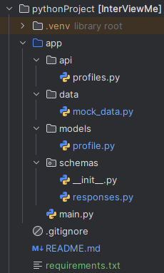

# InterViewMe - REST API для выживания на IT собеседованиях

REST API с профилями типичных собеседующих и советами как с ними работать.

<!-- Тут будет GIF с демонстрацией -->

## Что это?

Все мы встречали их: собеседующего который час мучает тебя алгоритмами, или того что пытается шутить про "нашего девопса Петю". 

Я решил собрать этих персонажей в API. Получилось 4 типа - от технического зануды до расслабленного философа. У каждого есть типичные фразы, советы как с ним общаться, и юмористические способы "мести" (чисто поржать).

Проект сделан скорее для портфолио - показать что могу спроектировать API с нормальной архитектурой и документацией. Ну и немного посмеяться в процессе разработки.

## Что умеет

Сейчас API позволяет:
- Получить список всех типов собеседующих  
- Посмотреть конкретный профиль с описанием
- Получить случайную фразу которую обычно говорит этот тип
- Взять совет как лучше с ним общаться
- Почитать смешные "тактики мести"

## Технологии

Использую современный Python стек:
- Python 3.9+
- FastAPI для быстрой разработки API и автогенерации документации
- Pydantic для валидации данных  
- Uvicorn как ASGI сервер

Пока данные хранятся в Python файлах, но планируется перейти на SQLite, а потом на PostgreSQL.

## Структура проекта



## Как запустить

Нужен Python 3.9 или новее.

Клонируем репозиторий:
```bash
git clone https://github.com/username/InterViewMe.git
cd InterViewMe
```

Ставим зависимости:
```bash
pip install -r requirements.txt
```

Запускаем:
```bash
uvicorn app.main:app --reload
```

Заходим на http://localhost:8000/docs - там будет Swagger UI с документацией.

## API

Основные эндпоинты:

**GET /profiles/** - все профили собеседующих

**GET /profiles/{id}** - конкретный профиль по ID:
- 0 = Душнила (технические вопросы)  
- 1 = Раздувной (шутки и мемы)
- 2 = Чилл-гай (философия и расслабон)
- 3 = Паникёр (вечно переживает)

**GET /profiles/{id}/random_phrase** - случайная фраза этого типа

**GET /profiles/{id}/random_advice** - совет как с ним общаться

**GET /profiles/{id}/random_revenge** - способ "мести" (для юмора)

Все ответы в JSON, есть примеры в Swagger документации.

## Планы

Планируется добавить:
- Нормальную базу данных вместо моков
- Больше типов собеседующих (может агрессивного, рассеянного)  
- ML фичу - определение типа по фразе которую написал пользователь
- Простой фронтенд чтобы можно было тыкать в браузере
- Может систему пользователей с сохранением статистики

## Статус

Проект активно пишется. Пока это MVP версия для демонстрации навыков.

## Контакты

dimagarn - sheldingcoder4@gmail.com - https://github.com/dimagarn

Репозиторий: https://github.com/dimagarn/InterViewMe